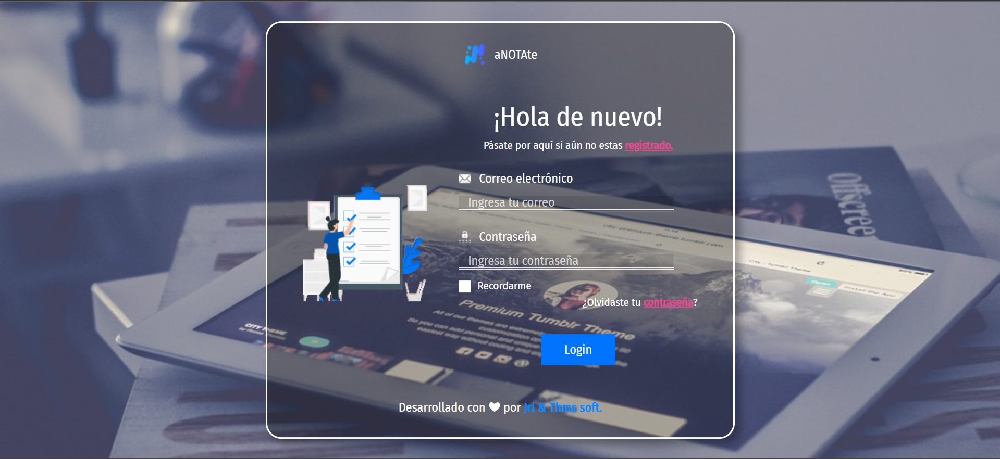
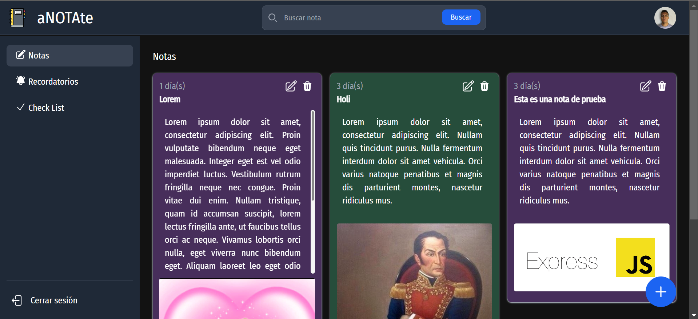

# Libreta

Este proyecto es una aplicación desarrollada con Angular y Tailwind CSS, consumiendo una API creada en Express en el backend, con validaciones realizadas mediante la librería Zod y utilizando el ORM Sequelize para la interacción con la base de datos tambien se hizo uso de JWT para la autentificación 

## Servidor de Desarrollo

Para ejecutar el servidor de desarrollo, utiliza el comando `ng serve`. Después, navega a `http://localhost:4200/` en tu navegador. La aplicación se recargará automáticamente si realizas algún cambio en los archivos fuente.

## Ejecutar el Backend

Para ejecutar el servidor backend, utiliza el comando `npm run start:server`.

## Ejecutar el Frontend

Para ejecutar el servidor frontend, utiliza el comando `ng serve`.

## Login

## vista principal
